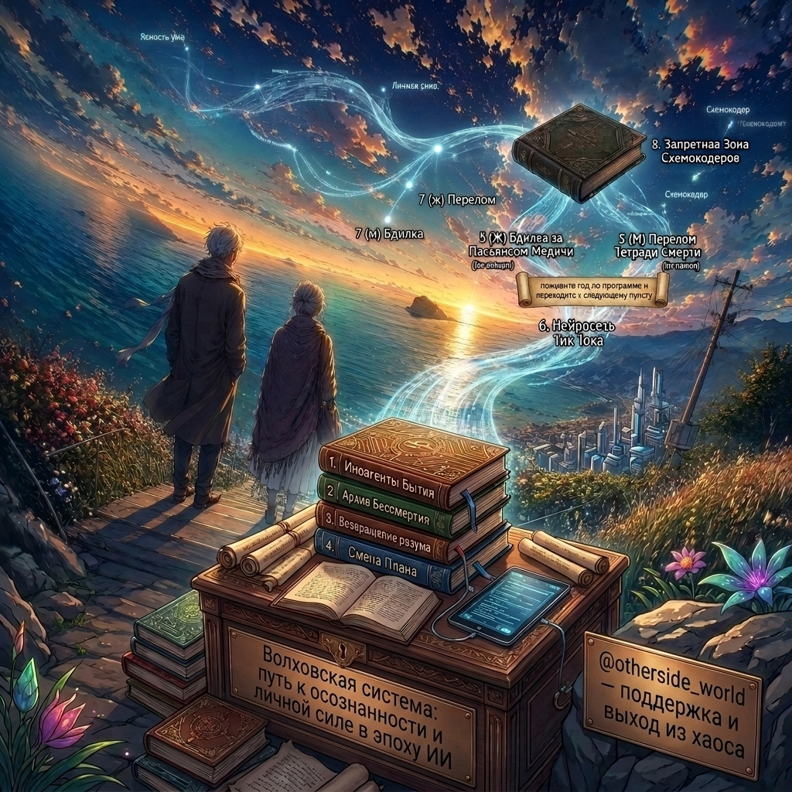

### 👋Привет, если с приветом!

Я занимаюсь php и javascript-программированием: 
   - [X] <a href="https://github.com/it-salamandr/botogame/blob/main/freedom/distribution/business_code/README.md">Бизнес код</a>
   - [X] <a href="https://github.com/it-salamandr/botogame/blob/main/freedom/distribution/resonance_code_constructor/README.md">Конструктор резонансного кода</a>
   - [X] <a href="https://github.com/it-salamandr/botogame/blob/main/freedom/distribution/resonant_code/README.md">Резонансный код</a>
   - [X] <a href="https://github.com/it-salamandr/botogame/blob/main/freedom/distribution/centered_site/README.md">Центрированный сайт</a>

А так же эзотерикой:

<b>1. Скил оптимальности: особенность | артефакт передвижения 👜м + 📿ж</b>
   - [X] <a href="https://github.com/it-salamandr/botogame/blob/main/freedom/interaction/creating_privileges/README.md">Создание привилегий</a>
   - [X] <a href="https://github.com/it-salamandr/botogame/blob/main/freedom/interaction/other_knowledge/README.md">Иное познание</a>

<b>2. Скил практичности: комплектация | артефакт сокрытия 💍м + 🪢ж</b>
   - [X] <a href="https://github.com/it-salamandr/botogame/blob/main/freedom/order/portable_food/README.md">Портативная еда</a>
   - [X] <a href="https://github.com/it-salamandr/botogame/blob/main/freedom/order/maze_game/README.md">Игра лабиринт</a>
   
<b>3. Скил деликатности: взаимодействие | артефакт обобщения 💍ж + 🪢м</b>
   - [X] <a href="https://github.com/it-salamandr/botogame/blob/main/freedom/interaction/talent_catalyst/README.md">Катализатор талантов</a>
   - [X] <a href="https://github.com/it-salamandr/botogame/blob/main/freedom/interaction/education_individuality/README.md">Образование индивидуальности</a>

<b>4. Скил эффективности: распределение | артефакт хранения 👜ж + 📿м</b>
   - [X] <a href="https://github.com/it-salamandr/botogame/blob/main/freedom/uniqueness/different_understanding_capitalism/README.md">Иное понимание капитализма</a>
   - [X] <a href="https://github.com/it-salamandr/botogame/blob/main/freedom/uniqueness/planning_basics/README.md">Основы планирования</a>

Проекты с галочкой означают что проекты были доведены до целостного формата "выживание" (50 на 50 верно). Но это не конец, доработка продолжается в новом проекте: <a href="https://otherside-world.ru">изнанка мира</a>. Так же концепции моего мировозрения изложены в <a href="https://www.litres.ru/author/andrey-volkov-33168547/">моих книгах</a>.

